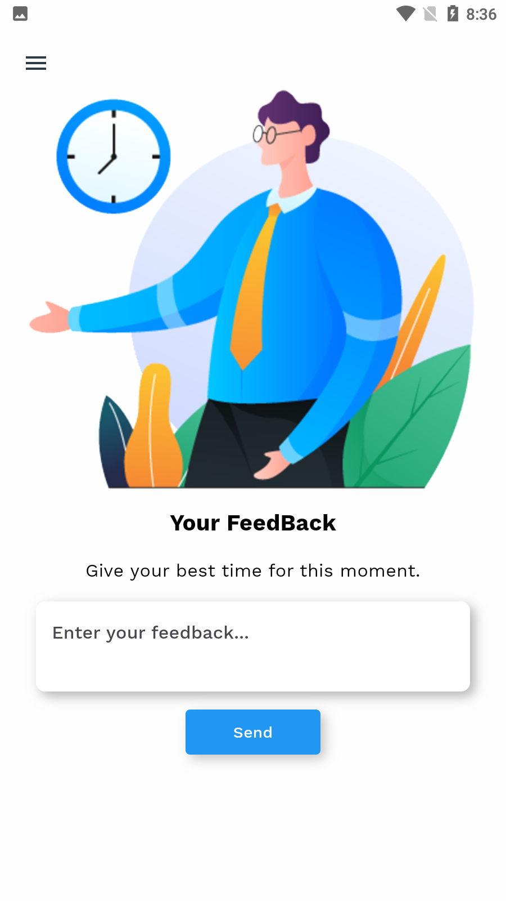

# Flutter Animation App

A Flutter-based application showcasing various animations and UI designs.

[Download APK](https://github.com/jamalihassan0307/Flutter-Animation-App/releases/download/1.0.0/app-armeabi-v7a-release.apk)

# Projects Screenshots

## Animation GIFs
<table border="1">
  <tr>
    <td style="width:33%; padding:5px;">
      
    </td>
    <td style="width:33%; padding:5px;">
      
    </td>
    <td style="width:33%; padding:5px;">
      
    </td>
  </tr>
  <tr>
    <td align="center">
<b>Animation 1</b>
</td>
    <td align="center">
<b>Animation 2</b>
</td>
    <td align="center">
<b>Animation 3</b>
</td>
  </tr>
</table>

## Static Screenshots
<table border="1">
  <tr>
    <td style="width:33%; padding:5px;">
      
    </td>
    <td style="width:33%; padding:5px;">
      
    </td>
    <td style="width:33%; padding:5px;">
      
    </td>
  </tr>
  <tr>
    <td align="center">
<b>Course App 1</b>
</td>
    <td align="center">
<b>Course App 2</b>
</td>
    <td align="center">
<b>Course App 3</b>
</td>
  </tr>
  
  <tr>
    <td style="width:33%; padding:5px;">
      
    </td>
    <td style="width:33%; padding:5px;">
      
    </td>
    <td style="width:33%; padding:5px;">
      
    </td>
  </tr>
  <tr>
    <td align="center">
<b>Feedback</b>
</td>
    <td align="center">
<b>Fitness App 1</b>
</td>
    <td align="center">
<b>Fitness App 2</b>
</td>
  </tr>

  <tr>
    <td style="width:33%; padding:5px;">
      
    </td>
    <td style="width:33%; padding:5px;">
      
    </td>
    <td style="width:33%; padding:5px;">
      
    </td>
  </tr>
  <tr>
    <td align="center">
<b>Fitness App 3</b>
</td>
    <td align="center">
<b>Help</b>
</td>
    <td align="center">
<b>Hotel Home Filter</b>
</td>
  </tr>

  <tr>
    <td style="width:33%; padding:5px;">
      
    </td>
    <td style="width:33%; padding:5px;">
      
    </td>
    <td style="width:33%; padding:5px;">
      
    </td>
  </tr>
  <tr>
    <td align="center">
<b>Hotel Home Screen 1</b>
</td>
    <td align="center">
<b>Hotel Home Screen 2</b>
</td>
    <td align="center">
<b>Introduction Animation 1</b>
</td>
  </tr>

  <tr>
    <td style="width:33%; padding:5px;">
      
    </td>
    <td style="width:33%; padding:5px;">
      
    </td>
    <td style="width:33%; padding:5px;">
      
    </td>
  </tr>
  <tr>
    <td align="center">
<b>Introduction Animation 2</b>
</td>
    <td align="center">
<b>Introduction Animation 3</b>
</td>
    <td align="center">
<b>Introduction Animation 4</b>
</td>
  </tr>

  <tr>
    <td style="width:33%; padding:5px;">
      
    </td>
    <td style="width:33%; padding:5px;">
      
    </td>
    <td style="width:33%; padding:5px;">
      
    </td>
  </tr>
  <tr>
    <td align="center">
<b>Introduction Animation 5</b>
</td>
    <td align="center">
<b>My Homepage Grid</b>
</td>
    <td align="center">
<b>My Homepage List</b>
</td>
  </tr>

  <tr>
    <td style="width:33%; padding:5px;">
      
    </td>
    <td style="width:33%; padding:5px;">
      
    </td>
    <td style="width:33%; padding:5px;">
      
    </td>
  </tr>
  <tr>
    <td align="center">
<b>Navigation Home Screen</b>
</td>
    <td align="center">
<b>Shear</b>
</td>
    <td align="center">
<b>Feedback</b>
</td>
  </tr>
</table>

## About Me

Hey there! I'm Ali Hassan, a passionate learner in the field of Flutter Application Development.

- 🔭 Currently learning Flutter Application Development
- 🤔 Exploring new technologies and developing software solutions and quick hacks
- 🎓 Studying Computer Science, computer programming, and Mathematics

## Tech Stack

- 🌐 Flutter
- 🛢 Object-Oriented Programming (OOP)
- 🛢 Basics of C++ and Java

## Features

- **User Authentication**: Secure access for users.
- **Profile Management**: Personalized profiles for each user.
- **Animation Showcase**: Various animations to enhance user experience.

## Getting Started

To get started with the Flutter Animation App:

1. Clone this repository.
2. Set up Flutter development environment if not already installed.
3. Run `flutter run` to launch the application.

## Connect with Me

You can connect with me via:

- [Facebook](https://web.facebook.com/jamali.hassan.946)
- [LinkedIn](https://www.linkedin.com/feed/)
- Email: jamalihassan0307@gmail.com
- WhatsApp: +923073921189

Feel free to reach out for any inquiries or collaborations!

⭐️ From Ali Hassan
